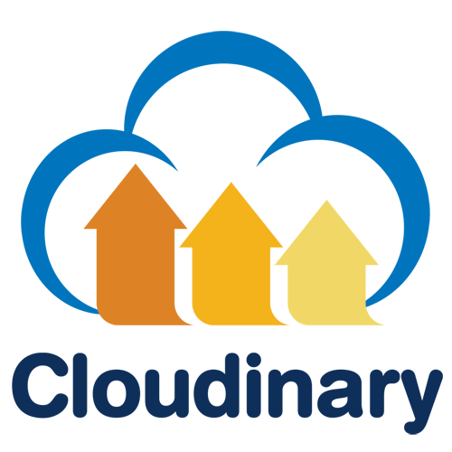
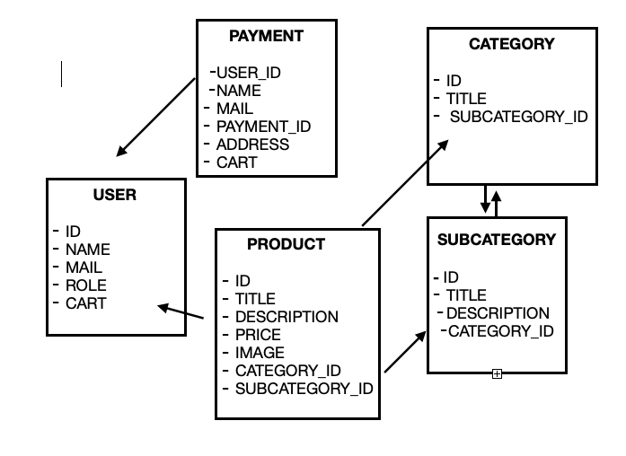

# proyectofinal

<body>
<h1>E-COMMERCE _FUSCA HOUSE</h1>
<h2>Descripción del proyecto</h2>

Fusca House consiste en un proyecto de tienda on-line de productos de decoración y muebles para el hogar.
No es necesario registrarse para ver todas las categorias y productos, pero sí para añadir los productos a su carrito, realizar compras y verificar todos los pedidos realizados

<h2>Tecnologías empleadas</h2>
<ul>
 <li></img></li>
 <li></img></li>
 <li></img></li>
 <li></img></li>
</ul>

<h2>Funcionalidades de la aplicación</h2>

<h3>Sistema de Registro y Login</h3>
<h4>Para poder registrarse:</h4>

.post(/register) = Ruta abierta para que el usuario se registre

Proceso:

<ol>
 <li>El usuario debe introducir nombre, apellido, mail y contraseña</li>
 <li>Verificación de mail (que no este registrado y que cumpla el formato)</li>
 <li>Verificación de contraseña (que cumpla requisitos, por ej: mínimo 6 caracteres)</li>
 <li>Encriptación de contraseña</li>
 <li>Creación de Clave Token</li>
</ol>
<h4>Para poder logearse:</h4>

.post(/login) = Ruta abierta para que el usuario haga el login

<ol>
 <li>El usuario debe introducir el mail y la contraseña que utilizó para registrarse</li>
 <li>Autenticación de sus credenciales con la base de datos</li>
 <li>Generación de nueva clave Token que da acceso a las diferentes funcionalidades</li>
</ol>

<h3>Panel de Usuario logeado</h3>

Hay 2 tipos de usuarios, Rutas, accesos y funcionalidades dentro de la aplicación:

<ul>
 <li>Acceso a todas las categorias y productos - RUTA ABIERTA</li>
 <li>Puede agregar productos a su carrito - RUTA PRIVADA</li>
 <li>Puede efectuar compras y ver todos los pagos realizadas - RUTA PRIVADA</li>
 <li>Acceso a todos los pedidos anteriores - RUTA PRIVADA</li>
 <li>Puede acceder, modificar y eliminar su perfil cuando lo desee - RUTA PRIVADA</li>
</ul>
<h3>Panel de Administrador - rol asignado en la base de datos</h3>

Rutas(todas privadas), accesos y funcionalidades dentro de la aplicación:

<ul>
 <li>Podrá crear, acceder, modificar y eliminar todas las categorias, subcategorias y productos</li>
 <li>Podrá subir y eliminar imágenes</li>
 <li>Acceso a todos los pedidos y pagos realizados de la tienda o de un usuario en concreto</li>
 <li>Puede acceder, modificar o eliminar la información o perfil de un usuario</li>
 <li>Puede acceder a todos los usuarios registrados en la tienda</li>
</ul>

<h2>BACK-END</h2>

Levantar un servidor desarrollado en NODE JS y conectar con la Base de Datos alojada en MONGODB

<h3>Dependencias principales utilizadas</h3>
<ul>
 <li>EXPRESS - necesaria para crear el servidor</li>
 <li>NODEMON - actualiza los cambios en tiempo real visibles en la terminal</li>
 <li>MONGOOSE - me conecta y permite manejar una base de datos en la nube</li>
 <li>DOTENV - me guarda esa base de datos en un archivo escondido (.env)</li>
</ul>

Comandos para arrancar el servidor => npm run dev

<h3>Dependencias secundarias utilizadas</h3>
<ul>
 <li>Bcrypt</li>
 <li>JsonWebToken</li>
 <li>Cloudinary</li>
 <li>Fs</li>
 <li>Express-fileupload</li>
</ul>

<h2>MODELOS DE DATOS DE MI APLICACIÓN</h2>

</img>

<h2>RUTAS:</h2>
<h3>USER:</h3>

.post(/register) Ruta para crear un user - RUTA ABIERTA  
.post(/login) Ruta para log in - RUTA ABIERTA 
.get(/users) Ruta para ver todos los usuarios - RUTA PRIVADA ADMIN 
.get(/user) Ruta para que el usuario vea su perfil - RUTA PRIVADA USER 
.put(/user) Ruta para que el user modifique su perfil - RUTA PRIVADA USER 
.delete(/user) Ruta para que el user elimine su cuenta - RUTA PRIVADA USER 
.putRuta para que el admin modifique un user - RUTA PRIVADA ADMIN 
- Ruta para que el admin elimine un user - RUTA PRIVADA ADMIN 
- Ruta para acceder a todas las ventas - RUTA PRIVADA ADMIN 
- Ruta para acceder a todas tus compras - RUTA PRIVADA USER 

<h3>PRODUCT:</h3>

- Ruta para ver todos los productos - RUTA ABIERTA 
- Ruta para ver un producto - RUTA ABIERTA 
- Ruta para crear un producto - RUTA PRIVADA ADMIN 
- Ruta para modificar un producto - RUTA PRIVADA ADMIN 
- Ruta para eliminar un producto - RUTA PRIVADA ADMIN 
- Ruta para ver todos los productos pro - RUTA PRIVADA USER PRO 
- Ruta para seleccionar y agregar uno o varios productos en mi carrito - RUTA PRIVADA

<h3>CATEGORY:</h3>

- Ruta para ver una categoria - RUTA ABIERTA 
- Ruta para ver todas las categorías - RUTA ABIERTA 
- Ruta para ver todas las categorias pro - RUTA PRIVADA USER PRO 
- Ruta para crear categoria nueva - RUTA PRIVADA ADMIN 
- Ruta para modificar una categoria - RUTA PRIVADA ADMIN 
- Ruta para eliminar una categoria - RUTA PRIADA ADMIN

