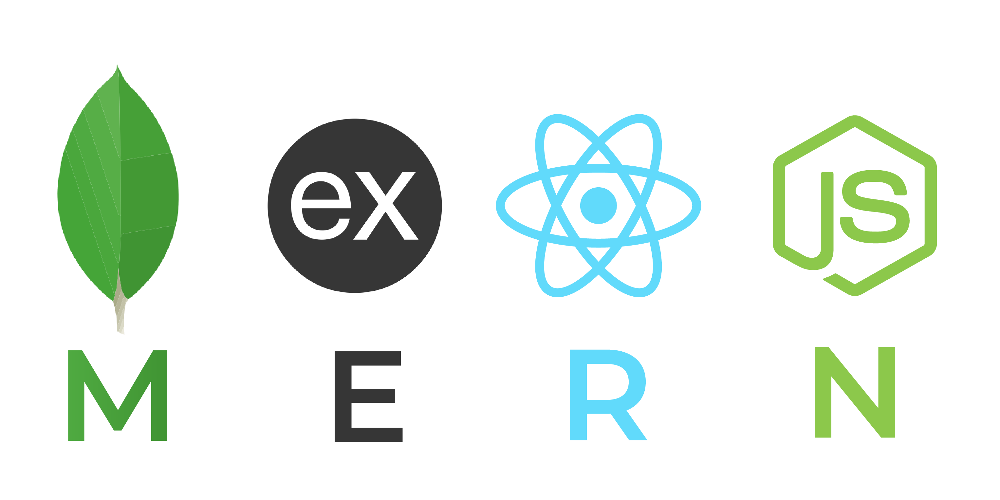

# proyectofinal

<body>
<h1>E-COMMERCE _FUSCA HOUSE</h1>
<h2>Proyect Description:</h2>

Fusca House is an e-commerce project, created from scratch, of home decoration and furniture products.  I performed the Development and construction of the Back and Frontend of my application (e-commerce).

<h2>Main Technologies used:</h2>
<ul>
 <li></img></li>
 
MONGODB, EXPRESS, REACTjs, NODEjs

  
 <li></img></li>
 
HTML, CSS, JAVASCRIPT

</ul>

<h3>Others:</h3>
<ul>
<li></img></li>
<li></img></li>
<li></img></li>
<li></img></li>
<li></img></li>
</ul>

<h2>Application functionalities:</h2>
<h4>It is not necessary to be registered as a user to view all categories and products, but it is necessary if you want to add products to your cart, make a payment and check all orders.</h4>

<h3>Registration and Login System</h3>
<h4>To be able to register:</h4>

.post(/register) = Public route for user registration 

Process:

<ol>
 <li>The user must enter first name, a valid email and create a password.</li>
 <li>Email verification to check that is not already registered in the Database and that complies with the format</li>
 <li>Password verification (must meet requirements, e.g. minimum 6 characters)</li>
 <li>Password encryption</li>
 <li>Token Key Creation</li>
</ol>
<h4>To be able to log in:</h4>

.post(/login) = Public route for the user to login

Process:

<ol>
 <li>The user must enter the email and password used to register.</li>
 <li>Authentication of his credentials with the Database.</li>
 <li>Generation of a new token key that gives access to the different functionalities.</li>
</ol>

<h3>User Login Panel</h3>

Routes, accesses and functionalities within the application:

<ul>
 <li>Access to all categories - PUBLIC ROUTE</li>
 <li>Access to all products - PUBLIC ROUTE</li>
 <li>You can add products to your cart - PRIVATE ROUTE</li>
 <li>You can make payments and view all payments made - PRIVATE ROUTE</li>
 <li>Access to all orders - PRIVATE ROUTE</li>
 <li>You can access, modify and delete your profile at any time - PRIVATE ROUTE</li>
</ul>
<h3>Administrator Panel - role assigned in the Database</h3>

Routes (all private), accesses and functionalities within the application:

<ul>
 <li>You will be able to create, access, modify and delete all categories, subcategories and products.</li>
 <li>You can upload and delete images</li>
 <li>Access to all orders and payments made for the store or for a specific user.</li>
 <li>You can access, modify or delete a user's information or profile.</li>
 <li>You can access to all registered users in the store.</li>
 <li>You can assign roles in the database</li>
</ul>

 
<h2>BACK-END ARQUITECTURE</h2>

Start and set up a server developed in NODE JS and connect to the database hosted in MONGODB.

<h3>Main dependencies used</h3>
<ul>
 <li>EXPRESS - necessary to create and run the server</li>
 <li>NODEMON - updates the changes in real time visible in the terminal</li>
 <li>MONGOOSE - connects me to and allows me to manage a database in the cloud.</li>
 <li>DOTENV - saves that database to a hidden file (.env)</li>
</ul>

 Commands to start the server => npm run dev

<h3>Secondary dependencies used</h3>
<ul>
 <li>Bcrypt</li>
 <li>JsonWebToken</li>
 <li>Cloudinary</li>
 <li>Fs</li>
 <li>Express-fileupload</li>
</ul>

<h2>DATA MODELS OF MY APPLICATION</h2>

</img>

<h2>ROUTES:</h2>

Server is running con port 5001. Starting end-point: http://localhost:5001/api/"end-point"
All routes testing were done on Postman.

<h3>USER:</h3>

.post(/register) Route to create an user - PUBLIC ROUTE  
.post(/login) Route to log in - PUBLIC ROUTE 
.get(/users) Route to access to all registered users - PRIVATE ADMIN ROUTE 
.get(/user) Route for the loged in user`s profile - PRIVATE USER ROUTE 
.put(/user) Route for the user to modify his profile - PRIVATE USER ROUTE 
.delete(/user) Route for the user to delete his account - PRIVATE USER ROUTE 
.put(/user/:id) Route for the admin to modify a user - PRIVATE ADMIN ROUTE 
.delete(/user/:id) Route for the admin to delete a user - PRIVATE ADMIN ROUTE 
.post(/cart) Route to add products to cart - PRIVATE USER ROUTE 
.get(/orders) Route to all sales - PRIVATE ADMIN ROUTE 
.get(/cart) Route to access the shopping cart - PRIVATE USER ROUTE 

<h3>PRODUCT:</h3>

.get(/product/:id) Route to view a specific product - PUBLIC ROUTE 
.get(/products) Route to view all products - PUBLIC ROUTE 
.post(/product) Route to create a product - PRIVATE ADMIN ROUTE 
.put(/product/:id) Route to modify a product - PRIVATE ADMIN ROUTE 
.delete(product/:id) Route to delete a product - PRIVATE ADMIN ROUTE 
.get(/productspro) Route to view all pro products - PRIVATE USER PRO ROUTE 
.post(/cart) Route to select and add products to my cart - PRIVATE USER ROUTE

<h3>CATEGORY:</h3>

.get(/category/:id) Route to view a specific category - PUBLIC ROUTE 
.get(/categories) Route to view all categories - PUBLIC ROUTE 
.get(/categoriespro) Route to view all pro categories - PRIVATE USER PRO ROUTE 
.post(/category) Route to create a new category - PRIVATE ADMIN ROUTE 
.put(/category/:id) Route to modify category - PRIVATE ADMIN ROUTE 
.delete(/category/:id) Route to delete category - PRIVATE ADMIN ROUTE

<h3>SUBCATEGORY:</h3>

.get(/subcategory/:id) Route to view a subcategory associated to a category - PUBLIC ROUTE 
.get(/subcategories) Route to view all subcategories of a specific category - PUBLIC ROUTE 
.post(/subcategory/:id) Route to create a subcategory associated to the id of a category - PRIVATE ADMIN ROUTE 
.put(/subcategory/:id) Route to modify a subcategory - PRIVATE ADMIN ROUTE 
.delete(/subcategory/:id) Route to delete a subcategory - PRIVATE ADMIN ROUTE

<h3>IMAGE:</h3>

.post(/upload) Route to upload an image - PRIVATE ADMIN ROUTE 
.post(/destroy) Route to delete an image - PRIVATE ADMIN ROUTE

<h3>PAYMENT:</h3>

.post(/payment) Route to make a payment - PRIVATE USER ROUTE 
.get(/payments) Route to view all payments made - PRIVATE USER ROUTE

 

<h2>FRONT-END APPLICATION</h2>

Design and Development of the Frontend using REACTjs, hosted on port 3000 and interacting with the database hosted in MONGODB. 

<h3>Main dependencies/libraries used:</h3>
<ul>
 <li>AXIOS - allows to make requests or calls to the content of an HTTP link.</li>
 <li>REACT-ROUTER-DOM - facilitates the process of defining navigation routes within our application.</li>
 <li>REACT-DOM - in charge of rendering React components for the browser.</li>
 <li>WEB-VITALS - quality indicators that are essential to provide an excellent user experience on the web.</li>
 <li>REACT-HOOKS - useState & useEffect</li>
 <li>REACT-BOOTSTRAP - CSS framework for proper styles of React</li>
</ul>

 Commands to run local server on front side => npm start

 <h2>ROUTES & COMPONENTS:</h2>

Local Server is hosted con port 3000. Starting end-point: http://localhost:3000/"end-point"

Navbar and Footer components are rendered in all routes

- Route path="/" render {Home.jsx} Component 
- Route path="/login" render {Login.jsx} Component 
- Route path="/logout" render {Logout.jsx} Component 
- Route path="/new_user" render {Register.jsx} Component 
- Route path="/my_profile" render {User.jsx} Component 
- Route path="/edit_myprofile" render {EditProfile.jsx} Component 
- Route path="/edit_user/:userId" render {EditUser.jsx} Component 
- Route path="/all_users" render {Users.jsx} Component 
- Route path="/new_in" render {NewIn.jsx} Component 
- Route path="/new_product" render {NewProduct.jsx} Component 
- Route path="/edit_product/:productId" render {EditProduct.jsx} Component 
- Route path="/product/:productId" render {Product.jsx} Component 
- Route path="/all_products" render {Products.jsx} Component 
- Route path="/new_category" render {NewCategory.jsx} Component 
- Route path="/all_categories" render {Categories.jsx} Component 
- Route path="/category/:categoryId" render {Category.jsx} Component 
- Route path="/edit_category/:categoryId" render {EditCategory.jsx} Component 
- Route path="/subcategory/:subcategoryId" render {Subcategory.jsx} Component 
- Route path="/new_subcategory/:categoryId" render {NewSubcategory.jsx} Component 
- Route path="/edit_subcategory/:subcategoryId" render {EditSubcategory.jsx} Component 

  

